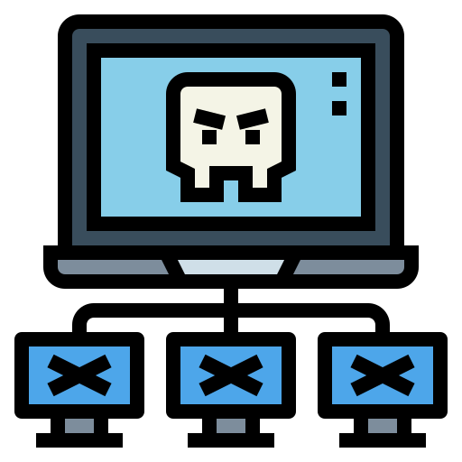

<p align="center">
  
  
  
  
  <a href="https://twitter.com/Flashouttt" target="_blank">
    
  </a>
</p>

<!-- PROJECT LOGO -->
<br />
<p align="center">
  <a href="https://github.com/Callumgm/ISO">
    
  </a>

  <h1 align="center">ISO</h1>

  <p align="center">
    Highly reliable, botnet
    <br />
    <a href="#commands"><strong>All Commands »</strong></a>
    <br />
    <br />
    <a href="https://github.com/Callumgm/ISO/issues">Report Bug</a>
    ·
    <a href="https://github.com/Callumgm/ISO/issues">Request Feature</a>
    ·
    <a href="https://github.com/Callumgm/ISO/pulls">Send a Pull Request</a>
  </p>
</p>

<br>


## <a id="content"></a>🌐 〢 Content

- [:dart:・About](#about)
- [:gear:・Commands](#commands)
- [:white_check_mark:・Requirements](#requirements)
- [:pushpin:・Todo/Enhancements](#enhancements)
- [:thought_balloon:・Change Log](#changelog)
- [🤝・Contributing](#contributing)
- [🌟・Show your support](#support)
<!-- - [📝・License](#license) -->

## <a id="about"></a>:dart: 〢 About ##


15 🌟 Stars = Add anti debug to lower detection <br>
25 🌟 Stars = Add better and cleaner builder
35 🌟 Stars = Make the client payload run as a undeletable backdoor


> Do not scan the client compiled exe with any antivirus software, or it will be detected and rendered useless!


A botnet is a group of Internet-connected devices such as laptops, computors and servers, each of which runs one or more bots. Botnets can be used to steal data, send spam, and allow the attacker to access the device and its connection. The owner can control the botnet using command and control software over a very clean and modern GUI.

Eachd command has been created in mind to stop all crashes and unexpected fails meaning u never have to worry about loosing your connection. Open ports will be needed to be able to connect to the target machines. There are also many of ways to infect a device such a remote infection or the victim running a malious malawre application.
<br>

## <a id="commands"></a>:gear: 〢 Commands ##

```shell
> Change GUI Colors
> Check if client is running payload as admin
> Grab infomation about the target machine
> Clear the console
> Gain shell access to execute any shell/cmd command
> List all connected zombies
> Exit the server
> Kill client
```

## <a id="requirements"></a>:white_check_mark: 〢 Requirements ##

Before starting :checkered_flag:, you are required to have [Python 3.8 - 3.9](https://www.python.org/downloads/release/python-397/) installed and [added to path](https://docs.blender.org/manual/en/latest/_images/about_contribute_install_windows_installer.png).


## <a id="enhancements"></a>:pushpin: 〢 Todo/Enhancements ##

- [ ] Clean builder and obfusecate the code before compliling


## <a id="changelog"></a>:thought_balloon: 〢 Change Log ##

```diff
v1.0.0 ⋮ 2022-09-21
+ Initial commit
```


## <a id="contributing"></a>🤝 〢 Contributing ##
Contributions, issues and feature requests are welcome!<br />Feel free to check
[issues page](https://github.com/Callumgm/ISO/issues).  


## <a id="support"></a>🌟 〢 Show your support ##
Give a ⭐️ if this project helped you! 


<!-- ## <a id="license"></a>📝 〢 License ##
 Copyright © 2022
[CookiesKush420](https://github.com/Callumgm).<br />  This project is [MIT](https://github.com/Callumgm/ISO/blob/master/LICENSE) licensed. -->
